# BadmintonLab-Motion

Reference-motion style learning for humanoid badminton skills in Isaac Lab.

## Overview

BadmintonLab-Motion combines physics-based humanoid simulation, motion retargeting and adversarial motion-prior learning (AMP).

The main components are:

- `source/badmintonlab_motion/badmintonlab_motion/assets/`: court, shuttlecock and robot assets. Robot URDF/XML files and meshes are kept in `assets/robots`.
- `source/badmintonlab_motion/badmintonlab_motion/tasks/`: the environment, scene configuration, MDP terms, AMP motion preprocessing and RSL-RL configuration.
- `source/badmintonlab_motion/badmintonlab_motion/tasks/data/`: packaged T1 and T2 reference clips used by AMP.
- `scripts/`: environment inspection, random/zero agents and RSL-RL training/playback entry points.
- `demo/`: retargeting previews and trained T1 policy demonstrations.

## Installation

This project runs inside an Isaac Lab / Isaac Sim Python environment. Create or activate that environment first, then install the extension in editable mode:

```bash
git clone https://github.com/BadmintonLab1898/BadmintonLab-Motion.git
cd BadmintonLab-Motion
python -m pip install -e source/badmintonlab_motion
```

## Software environment

The following versions were checked in the Conda environment `env_isaaclab` used for development and evaluation:

| Software | Version |
| --- | --- |
| Isaac Lab | 2.2.1 |
| Isaac Sim | 5.0.0.0 |
| RSL-RL (`rsl-rl-lib`) | 3.0.1 |
| PyTorch | 2.7.0 |

## Usage

List the registered environments:

```bash
python scripts/list_envs.py
```

Train the default AMP task:

```bash
python scripts/rsl_rl/train.py --task BadmintonLab-Motion --headless
```

The current T1 shot-specific registrations are:

```text
BadmintonLab-Motion
BadmintonLab-Motion-Clear
BadmintonLab-Motion-Drop
BadmintonLab-Motion-Lift
```

To play a checkpoint, provide the task and checkpoint path to the playback script:

```bash
python scripts/rsl_rl/play.py \
    --task BadmintonLab-Motion \
    --checkpoint /path/to/model.pt
```

Use `--video` with `play.py` to record a rollout. The training script also supports standard RSL-RL options such as `--num_envs`, `--max_iterations`, `--resume` and `--run_name`.

## Demo

The T1 policy and retargeting previews below use optimized animated GIFs generated from the MP4 clips. Click a preview or its label to open the original MP4.

### Trained T1 policies

These are the three currently released policy demonstrations. Each preview is shown on its own row; click a GIF to open the original MP4.

<table>
<tr>
<td align="center"><a href="./demo/t1/clear.mp4">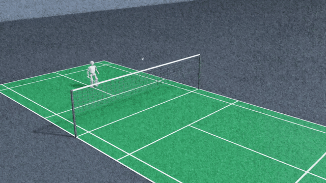</a><br><sub><a href="./demo/t1/clear.mp4">T1 Clear</a></sub></td>
</tr>
<tr>
<td align="center"><a href="./demo/t1/drop.mp4">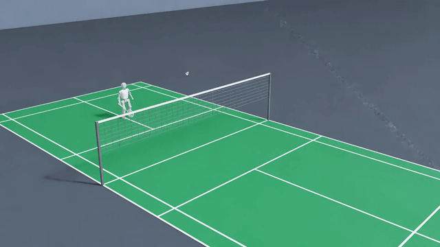</a><br><sub><a href="./demo/t1/drop.mp4">T1 Drop</a></sub></td>
</tr>
<tr>
<td align="center"><a href="./demo/t1/lift.mp4">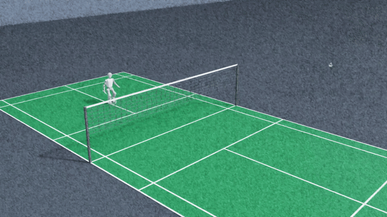</a><br><sub><a href="./demo/t1/lift.mp4">T1 Lift</a></sub></td>
</tr>
</table>

### Retargeted reference motions


<details>
<summary>T1 retargeting previews (23 clips)</summary>

<table>
<tr>
<td align="center">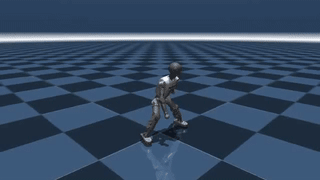<br><sub>Backhand receive1 success 001</sub></td>
<td align="center">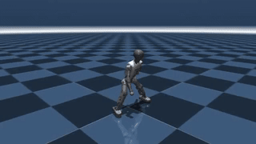<br><sub>Backhand receive2 success 001</sub></td>
<td align="center">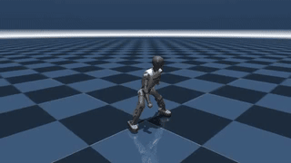<br><sub>Backhand receive3 success 001</sub></td>
<td align="center">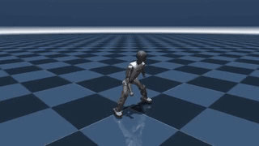<br><sub>BwdL step 001</sub></td>
</tr>
<tr>
<td align="center">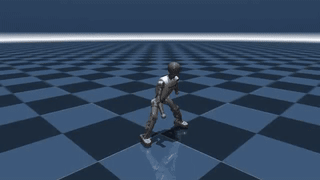<br><sub>BwdR step 001</sub></td>
<td align="center">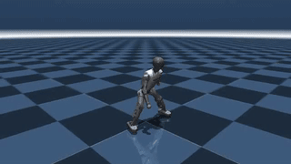<br><sub>BwdRun1 005</sub></td>
<td align="center">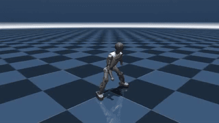<br><sub>Bwd step 002</sub></td>
<td align="center">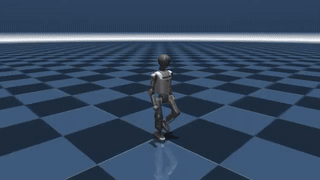<br><sub>Entry 004</sub></td>
</tr>
<tr>
<td align="center">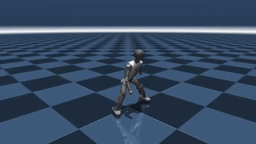<br><sub>Forehand receive1 success 002</sub></td>
<td align="center">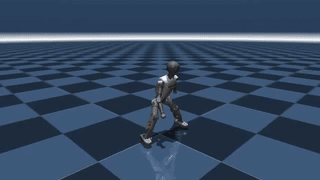<br><sub>Forehand receive2 success 001</sub></td>
<td align="center"><br><sub>Forehand receive3 success 001</sub></td>
<td align="center">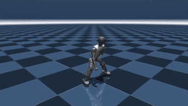<br><sub>FwdL step 001</sub></td>
</tr>
<tr>
<td align="center">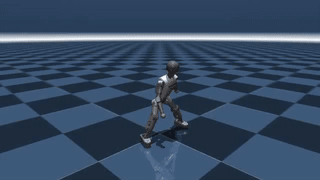<br><sub>FwdR step 001</sub></td>
<td align="center">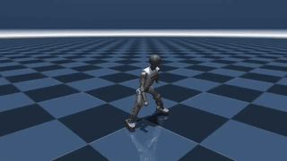<br><sub>Fwd step 002</sub></td>
<td align="center">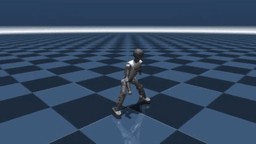<br><sub>Idle 1 002</sub></td>
<td align="center">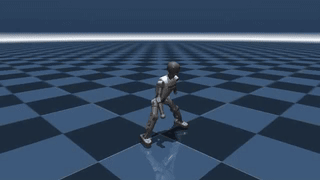<br><sub>Idle 2 003</sub></td>
</tr>
<tr>
<td align="center">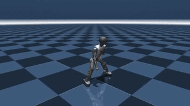<br><sub>Left step 001</sub></td>
<td align="center">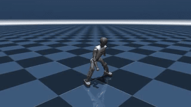<br><sub>Mid receive success 002</sub></td>
<td align="center">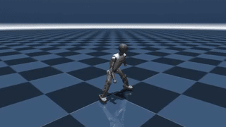<br><sub>Right step 002</sub></td>
<td align="center">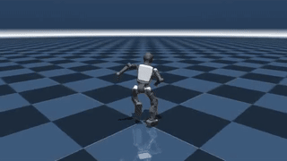<br><sub>Run 005</sub></td>
</tr>
<tr>
<td align="center">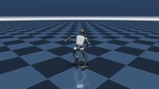<br><sub>Run 005 IP</sub></td>
<td align="center">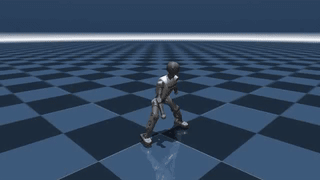<br><sub>Serve 004</sub></td>
<td align="center">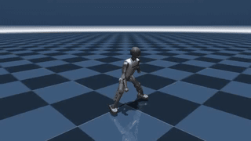<br><sub>Slide receive1 success 003</sub></td>
<td></td>
</tr>
</table>

</details>

<details>
<summary>T2 retargeting previews (23 clips)</summary>

<table>
<tr>
<td align="center">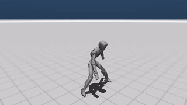<br><sub>Backhand receive1 success 001</sub></td>
<td align="center">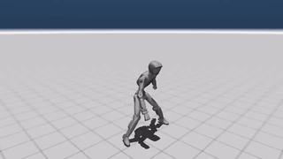<br><sub>Backhand receive2 success 001</sub></td>
<td align="center"><br><sub>Backhand receive3 success 001</sub></td>
<td align="center">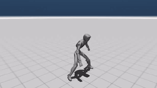<br><sub>BwdL step 001</sub></td>
</tr>
<tr>
<td align="center">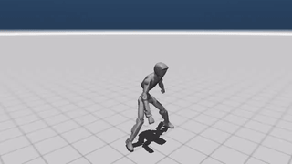<br><sub>BwdR step 001</sub></td>
<td align="center">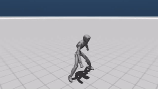<br><sub>BwdRun1 005</sub></td>
<td align="center">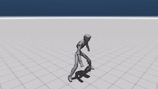<br><sub>Bwd step 002</sub></td>
<td align="center">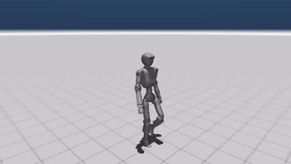<br><sub>Entry 004</sub></td>
</tr>
<tr>
<td align="center">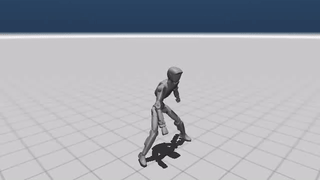<br><sub>Forehand receive1 success 002</sub></td>
<td align="center">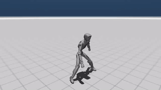<br><sub>Forehand receive2 success 001</sub></td>
<td align="center">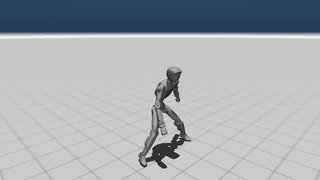<br><sub>Forehand receive3 success 001</sub></td>
<td align="center">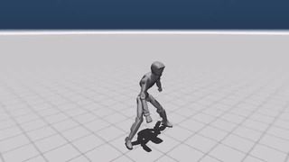<br><sub>FwdL step 001</sub></td>
</tr>
<tr>
<td align="center">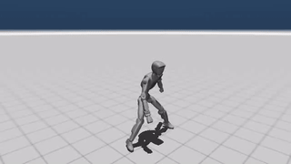<br><sub>FwdR step 001</sub></td>
<td align="center">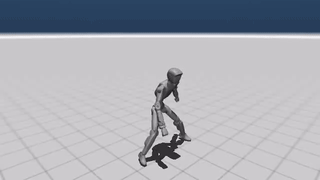<br><sub>Fwd step 002</sub></td>
<td align="center">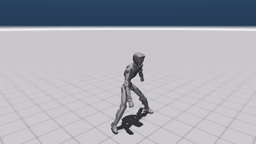<br><sub>Idle 1 002</sub></td>
<td align="center">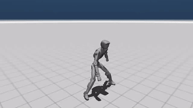<br><sub>Idle 2 003</sub></td>
</tr>
<tr>
<td align="center"><br><sub>Left step 001</sub></td>
<td align="center">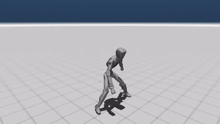<br><sub>Mid receive success 002</sub></td>
<td align="center">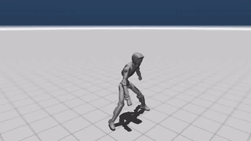<br><sub>Right step 002</sub></td>
<td align="center">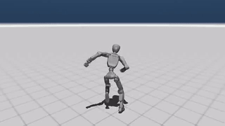<br><sub>Run 005</sub></td>
</tr>
<tr>
<td align="center">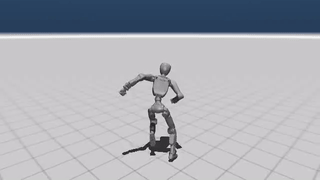<br><sub>Run 005 IP</sub></td>
<td align="center">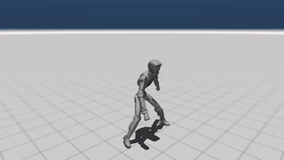<br><sub>Serve 004</sub></td>
<td align="center"><br><sub>Slide receive1 success 003</sub></td>
<td></td>
</tr>
</table>

</details>

## Project structure

```text
BadmintonLab-Motion/
├── demo/
│   ├── t1/                 # released trained-policy demonstrations
│   ├── t1_retarget/        # T1 retargeting previews
│   └── t2_retarget/        # T2 retargeting previews
├── scripts/
│   └── rsl_rl/
├── source/badmintonlab_motion/
│   └── badmintonlab_motion/
│       ├── assets/robots/  # URDF/XML files and meshes
│       └── tasks/          # environment, MDP and AMP code
└── README.md
```

## Acknowledgements and third-party resources

This project builds on and uses the following projects and resources:

- [Isaac Lab](https://github.com/isaac-sim/IsaacLab) for the simulation, task framework and reinforcement-learning integration.
- [Badminton Extra Motions](https://assetstore.unity.com/packages/3d/animations/badminton-extra-motions-167656#publisher) from the Unity Asset Store as an open motion-data resource for badminton retargeting and reference clips.
- [booster_assets](https://github.com/BoosterRobotics/booster_assets) from Booster Robotics / 加速进化 for robot assets and related configuration resources.

Please consult each upstream project or asset listing for its license and usage conditions. Their licenses and attribution requirements remain applicable to the corresponding third-party assets and data.
